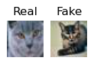
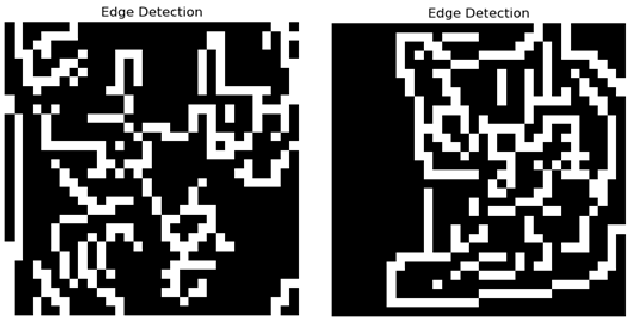
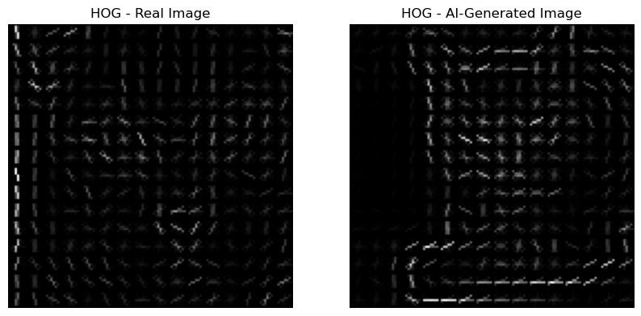

# 🔍 Fake Image Detection using Deep Learning

This project implements a deep learning-based image classification system to detect **AI-generated (fake)** versus **real** images. The model is trained on image datasets containing both authentic and synthetically generated content (e.g., from GANs or diffusion models).

---

## 🎯 Objective

To build a binary classifier that can accurately distinguish between real images and those generated by artificial intelligence, using convolutional neural networks and modern evaluation techniques.

---

## 🧠 Model Overview

- Custom CNN trained from scratch and fine-tuned ResNet/EfficientNet
- Binary classification: **Real vs. Fake**
- Optional explainability via **Grad-CAM**
- Robust evaluation with precision, recall, F1-score, and ROC-AUC

---

## 📂 Dataset

- **CIFAKE** dataset (or your custom dataset)
- Balanced dataset with `real/` and `fake/` folders
- Data split: Train / Test

---

## 🏁 How to Run

### 1. Clone the Repository

```bash
git clone https://github.com/your-username/Fake-Image-Detection.git
cd Fake-Image-Detection
```

### 2. Create a virtual environment (Optional)

```bash
python -m venv venv
source venv/bin/activate #For Windows: venv\Scripts\activate
```

### 3. Install Dependencies

```bash
pip install -r requirements.txt #Additionally for cuda first do: pip install torch torchvision torchaudio --index-url https://download.pytorch.org/whl/cu118
```

### 4. Download Data

Download the [CIFAKE](https://www.kaggle.com/datasets/birdy654/cifake-real-and-ai-generated-synthetic-images) dataset used for this project. Unzip the folder and place it in the root directory of this project and you should be ready to go.

### 5. Exploratory Data Analysis

To have a glance at how the data looks like by extracting some of the relevant features for this task, run the EDA.ipynb file.

### 6. Utilize CNN

One of the models used for this project is a CNN built from scratch and custom trained on CIFAKE. To custom train it on other data or use it, check the Baseline_CNN.ipynb file. The model is already available in Models directory of this project by the name of cifake_cnn.pth and can be used directly.

### 7. Utilize ResNet
This is the other model used for this project and like CNN, it is also custom trained on CIFAKE data. Just look into the ResNet50.ipynb file. It also contains the Grad-CAM analysis of results.

---

## 🧪 Output

Below is a sample image of real and AI generated Cat



When performing EDA on this image, it is evident from the comparison of edges and HOG for the image shown below that there are clear differences between the two.




---

## 📜 License
This project is open-source and available under the terms of the [MIT License](LICENSE).

---

## 🌟 Authors
Shail Patel
[GitHub](https://github.com/sapatel11) | [LinkedIn](https://linkedin.com/in/shail-p11)

Vrushali Ranadive
[Github](https://github.com/Vrushali31) | [LinkedIn](https://www.linkedin.com/in/vrushali-ranadive-79437a20a/)

Devanshu Shah
[Github](https://github.com/devanshu-777) | [LinkedIn](https://www.linkedin.com/in/devanshu-shah777/)